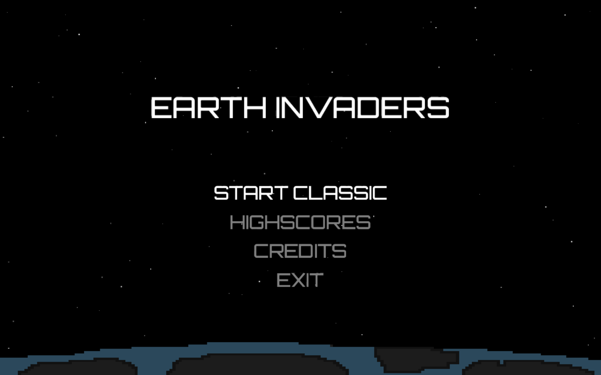
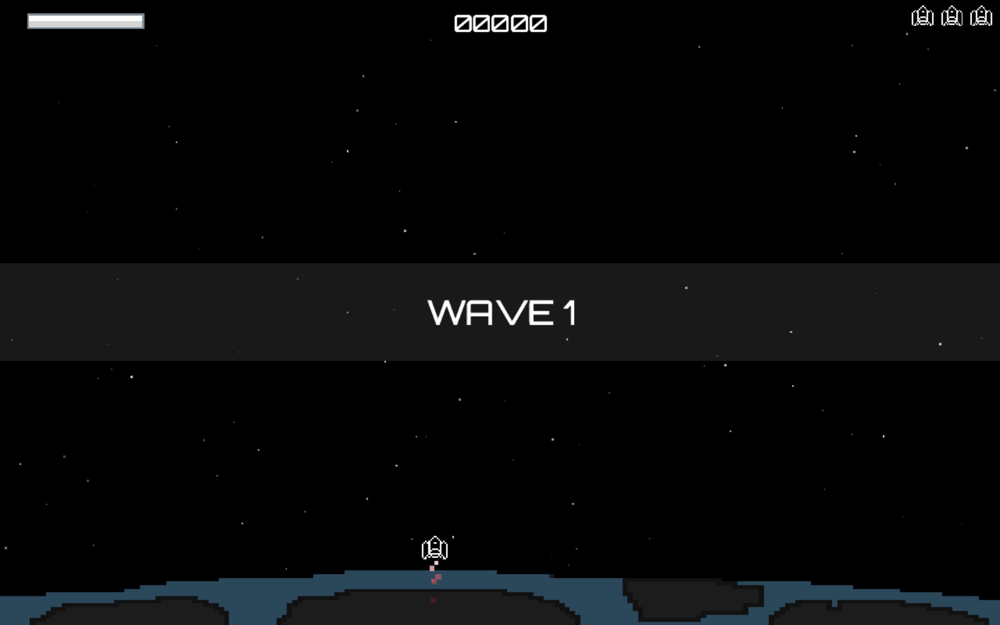
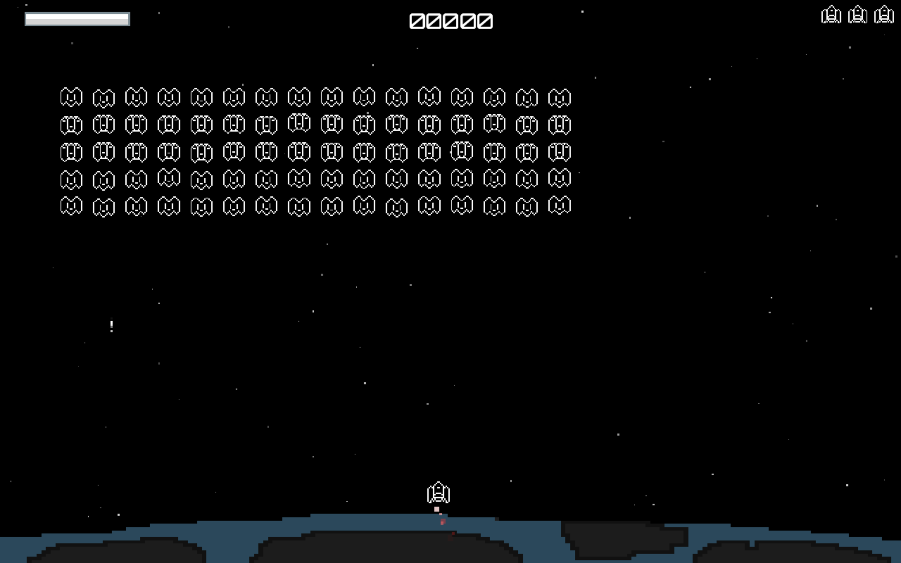

# EarthInvaders
Earth Invaders - a Space Invaders clone for the it-talents challenge.

# General
The game is developed in Java using the open-source LibGDX framework in combination with Android Studio.
The Project can be cloned or downloaded and then opened in Android Studio.
 
clone project by running `git clone https://github.com/flow96/EarthInvaders.git` in a terminal.

# Running the game
I provided runnables for Windows/Mac and a raw .jar file (jre 1.8 will be needed).
All of the runnables can be found within the <a href="https://github.com/flow96/EarthInvaders/tree/master/Runnables">Runnables</a> folder.
  
Start the game by double clicking one of the runnables or open a terminal in the root folder of the project and type `./gradlew desktop:run`
  
The <a href="https://github.com/flow96/EarthInvaders/tree/master/Runnable/Jar/">EarthInvaders.jar</a> file can be run with a terminal using: `java -jar EarthInvaders.jar`
 
 
# Controls
Ship controls: `A` and `D` or `left` and `right` arrow keys 
Shooting: `Space`

# Preview

 

 

